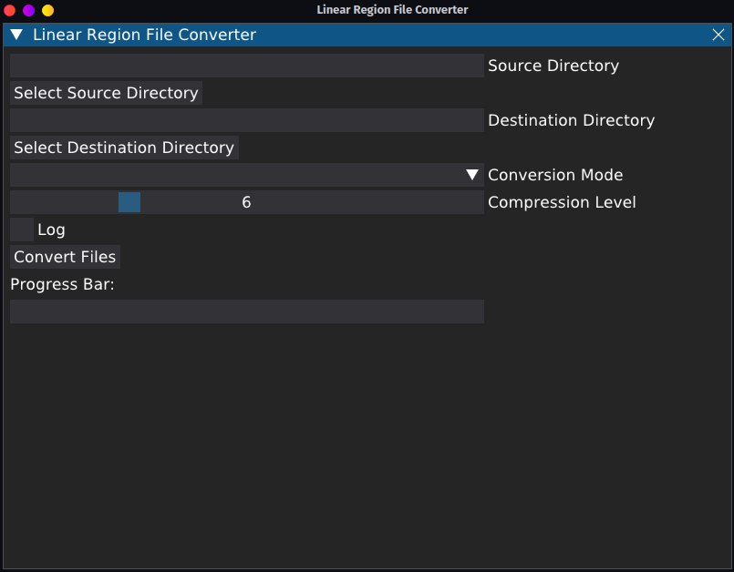

# Linear Region File Converter for Minecraft (GUI)



## Based on the original project [LinearRegionFileFormatTools](https://github.com/xymb-endcrystalme/LinearRegionFileFormatTools)

## What is Linear Region Format?

Linear region format saves about 50% of disk space in OW and Nether and 95% in The End.

This repository hosts tools to convert between `.mca` and `.linear`.

## Features:
- Saves about 50% of space when compared to Anvil
- Reads and writes whole files, so it will actually be _faster_ than `.mca` on a spinning HDD (way less IOPS than `.mca`)
- Replaces symlinks with files, thus allows caching on HDD
- Uses slightly more memory than Anvil - it has to store the whole region file in memory for individual chunk access
- Much simpler format - about 600 lines of code vs about 1000 LoC for Anvil

## Python Prerequisites:
```sh
apt install python3 python3-pip
virtualenv env
source env/bin/activate
pip3 install -r requirements.txt
```

## How to run:
```sh
python3 main.py
```

## How to build:
```sh
pyinstaller --onefile --add-data="font/DejaVuSans.ttf:font/." --name="Linear region file converter" main.py
```

